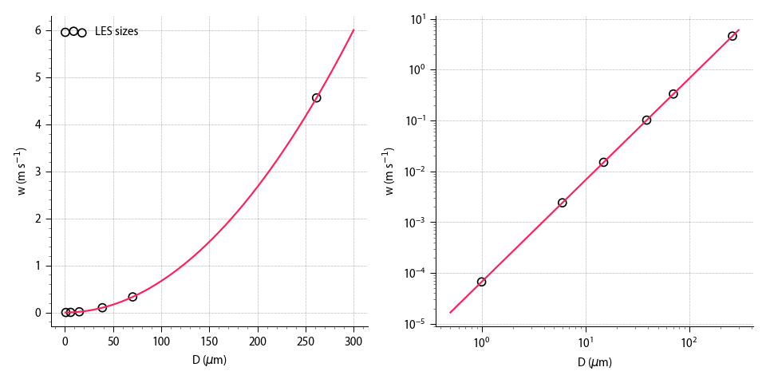

# Dust sedimentation

Simple example case based on `drycblles` + wind, with dust emission in several size categories from a circular field.

The sedimentation velocities follow a simple power law relation, following https://dx.doi.org/10.1063/1.5022089 .

